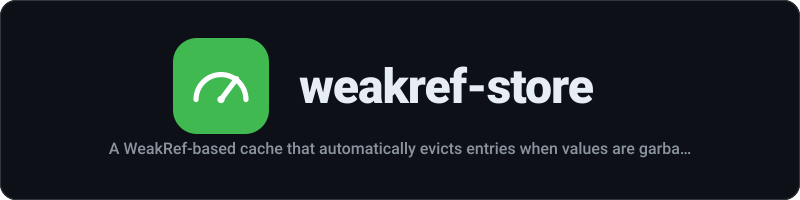

<div align="center">
  
</div>

<p align="center"><strong>A WeakRef-based cache that automatically evicts entries when values are garbage collected</strong></p>

<p align="center">
  <a href="https://github.com/mstuart/weakref-store/actions/workflows/main.yml"></a>
  <a href="LICENSE"></a>
  <a href="https://www.npmjs.com/package/weakref-store"></a>
  <a href="https://deepwiki.com/mstuart/weakref-store"></a>
  <a href="https://socket.dev/npm/package/weakref-store"></a>
  
</p>

---
## Install

```sh
npm install weakref-store
```

## Usage

```js
import WeakCache from 'weakref-store';

const cache = new WeakCache({
	onEvict(key) {
		console.log(`${key} was garbage collected`);
	},
});

let value = {data: 'hello'};
cache.set('key', value);

console.log(cache.get('key'));
//=> {data: 'hello'}

console.log(cache.has('key'));
//=> true
```

## API

### new WeakCache(options?)

#### options

Type: `object`

##### onEvict

Type: `(key) => void`

Callback invoked with the key when an entry is evicted by garbage collection.

### .get(key)

Returns the value for the key, or `undefined` if the key does not exist or its value has been garbage collected.

### .set(key, value)

Set a key-value pair. The value must be an object (required for `WeakRef`). Throws `TypeError` for primitives.

### .has(key)

Returns `true` if the key exists and the value is still alive.

### .delete(key)

Removes an entry. Returns `true` if the entry existed.

### .size

The approximate number of entries. May include entries whose values have been collected but not yet finalized.

## Related

- [WeakRef](https://developer.mozilla.org/en-US/docs/Web/JavaScript/Reference/Global_Objects/WeakRef) - MDN WeakRef documentation
- [FinalizationRegistry](https://developer.mozilla.org/en-US/docs/Web/JavaScript/Reference/Global_Objects/FinalizationRegistry) - MDN FinalizationRegistry documentation

## License

MIT
